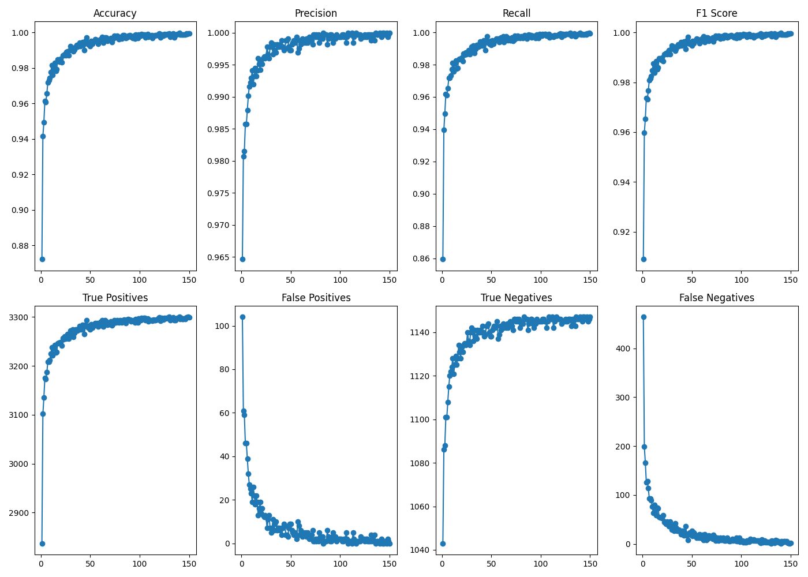

# Pneumonia Recognition
A deep learning application that detects pneumonia from chest X-ray images using a DenseNet201 model trained with PyTorch.

## Overview
This project utilizes Torch denseNet201 to classify chest X-rays as eithert normal(0), or pneumonia(1). The goal is to assist in medical image analysis via automated detection.

## Features
- DenseNet201 transfer learning
- GPU acceleration (CUDA/MPS)
- Training and evaluation pipelines
- Confusion matrix generation
- Accuracy, Precision, Recall, and F1 tracking
- ROC curve visualization

## Dataset

Dataset: Chest X-Ray Images (Pneumonia)

Classes:
- NORMAL
- PNEUMONIA

Images are resized to 224×224 before training, and grayscaled.

**Chest X-Ray Images (Pneumonia)**  
Sourced from [Kaggle](https://www.kaggle.com/datasets/paultimothymooney/chest-xray-pneumonia), originally published by Kermany et al.

> Kermany, D., Zhang, K., & Goldbaum, M. (2018). Identifying Medical Diagnoses and Treatable Diseases by Image-Based Deep Learning. *Cell*, 172(5), 1122–1131. https://doi.org/10.1016/j.cell.2018.02.010

## Installation

git clone https://github.com/cfr081709/pneumonia-recognition.git

cd pneumonia-recognition

pip install -r requirements.txt

## Training

python src/train.py

-Training Plot:

## Evaluation

python src/eval.py

## Testing

python src/test.py

## Full Pipeline

python src/main.py

## Results

### Training

pneumonia_recognition/results/train_results

### Eval

pneumonia_recognition/results/eval_results

### Testing

pneumonia_recognition/results/test_results

## Technologies

- Python
- PyTorch
- Torchvision
- Pandas
- Matplotlib
- Scikit-learn